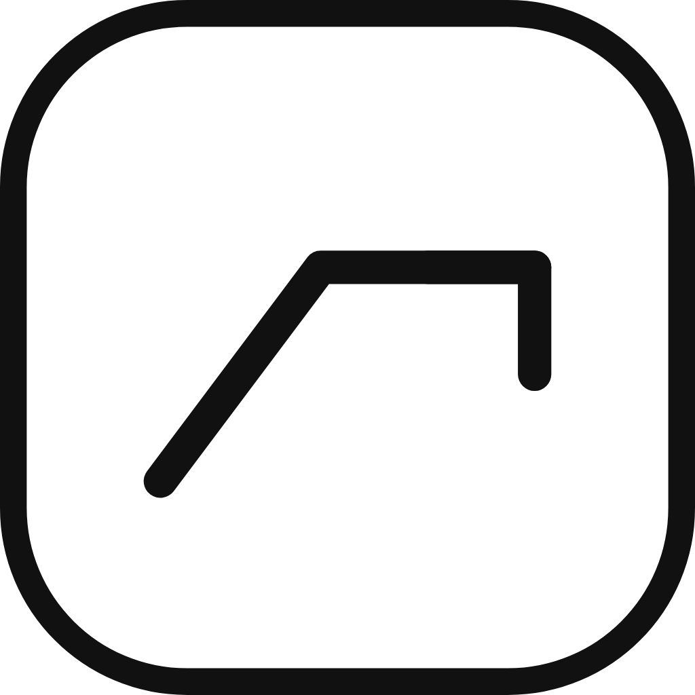

# <p align="center">TaskQuest</p> 

<p align="center">
  
</p>

A beautifully designed, gamified learning platform tailored specifically for Computer Science students. **TaskQuest** transforms daily study habits, coding challenges, and CS fundamentals into an engaging, "quest-like" experience.

---

## Features

* **Interactive Game Modes**: Put your knowledge to the test with 5 distinct mini-games:
  * **Syntax Sniper**: Spot the syntax error before time runs out.
  * **Code Blocks**: Drag & drop syntax puzzles for Python, JS, Java, and C++.
  * **Which Lang?**: Identify programming languages from clues and snippets.
  * **SDLC Sequence**: Master software development lifecycles (Agile, Waterfall, TDD).
  * **Solve Algorithm**: Trace pseudocode and calculate Big O complexities.
* **The Learning Explorer**: A rich discovery hub featuring language-agnostic crash courses (Data Structures, Algorithms, OOP, CLI Basics) and the "Daily Byte" of computing history.
* **AI-Powered Study Tools**: Uses **Gemini 2.5 Flash** to automatically scan uploaded documents or images and generate custom flashcard decks.
* **Gamified Progression**: Earn XP, build your daily streak, unlock badges, and climb the Global Leaderboard.
* **Premium UI/UX**: Built with a custom design system featuring `Syne` and `DM Mono` fonts, satisfying "Game Juice" (screen shakes & haptics), and reactive micro-interactions.
* **Cross-Platform**: Fully supported on Android, iOS, and Web.

## Tech Stack

* **Frontend:** Flutter & Dart
* **State Management:** Riverpod (`flutter_riverpod`)
* **Backend:** Firebase (Auth, Firestore NoSQL, Crashlytics, Cloud Messaging)
* **AI Integration:** Google Gen AI SDK (Gemini 2.5 Flash / 1.5 Flash fallback)
* **External APIs:** Dev.to (Trending Articles), Wikipedia API (History Timeline)

## Getting Started

### Prerequisites
* [Flutter SDK](https://docs.flutter.dev/get-started/install) (^3.11.0)
* A Firebase Project configured with `google-services.json` (Android) and `GoogleService-Info.plist` (iOS).

### Installation

1. **Clone the repository**
   ```bash
   git clone https://github.com/yourusername/taskquest.git
   cd taskquest
   ```

2. **Install dependencies**
   ```bash
   flutter pub get
   ```

3. **Set up API Keys**
   Ensure your Gemini API key is configured in `lib/core/constants/app_constants.dart`.

4. **Run the application**
   ```bash
   flutter run
   ```

## Architecture

TaskQuest utilizes a scalable, **feature-based architecture**:
* `lib/core/`: Global themes, constants, and custom algorithm utilities (Quick Sort, Binary Search).
* `lib/features/`: Independent domains for `auth/`, `home/`, `explore/`, `games/`, `profile/`, and `settings/`.
* `lib/features/shared/`: Reusable widgets like the `MainScaffold`, `ScaleOnTap`, and `ShakeWidget`.

## Contributing
Contributions, issues, and feature requests are welcome! Feel free to check the [issues page](../../issues).

## License
This project is for educational purposes. All learning content remains the property of TaskQuest and its contributors.
